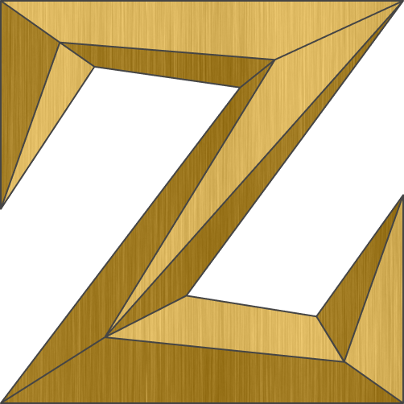

# Zaniac.io 

> Personal Landing Page / Website.

#### IMAGES & ICONS
[SVG Image](https://www.123rf.com/photo_99615753_stock-vector-decorative-corners-swirls-ornate-frame-page-decoration-wedding-design-filigree-dividers-vector-illus.html) - Ornate Frame Component 
[Blended Image](https://www.behance.net/gallery/60064327/20-Seamless-Brushed-Metal-Background-Textures-DOWNLOAD) - Site Logo (Texture) 
[SVG Image](https://app.haikei.app/) - Multi-Layered Waves (Randomly Generated) 
[Blended Image](https://www.toptal.com/designers/subtlepatterns/rocky-wall/) - Hero Section (Background Texture) 

#### UTILITY SITES
[Figma](https://www.figma.com/) - Site Logo; Animated Waves; SVG Alterations 
[Favicon Generator](https://realfavicongenerator.net/) - Site Favicon Assets 
[Vivus Instant](https://maxwellito.github.io/vivus-instant/) - SVG Animations 