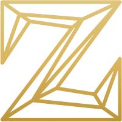

# Zaniac.io 

> Personal Landing Page / Website.

#### IMAGES / ICONS / BACKGROUND PATTERNS

[SVG Image](https://stock.adobe.com/images/id/340190715?as_campaign=Freepik&as_content=api&as_audience=idp&tduid=1f873e13bf364be98828b44724e23979&as_channel=affiliate&as_campclass=redirect&as_source=arvato) - Ornate Frame Component 
[SVG Image](https://app.haikei.app/) - Multi-Layered Waves (Randomly Generated) 
[Blended Image](https://www.behance.net/gallery/60064327/20-Seamless-Brushed-Metal-Background-Textures-DOWNLOAD) - Site Logo (Texture) 
[Blended Image](https://www.toptal.com/designers/subtlepatterns/rocky-wall/) - Hero Section (Background Texture) 

#### UTILITY SITES

[Figma](https://www.figma.com/) - Site Logo; Animated Waves; SVG Alterations 
[Favicon Generator](https://realfavicongenerator.net/) - Site Favicon Assets 
[Vivus Instant](https://maxwellito.github.io/vivus-instant/) - SVG Animations 
